# Prometheus_grafana_monitoring
Prometheus_Grafana_Monitoring This repository provides the setup and configuration for monitoring systems and applications using Prometheus and Grafana. It includes configurations, dashboards, and examples to help you quickly get started with monitoring and visualization.

Steps:

1) Update the system to the lates 
apt update -y
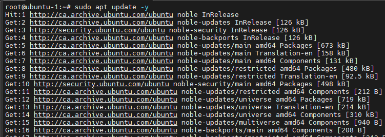

2) Create system user and the Directory for prometheus
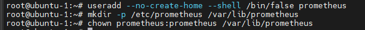

3) Download the Prometheus binary files to the /tmp folder
cd /tmp/
wget https://github.com/prometheus/prometheus/releases/download/v2.46.0/prometheus-2.46.0.linux-amd64.tar.gz
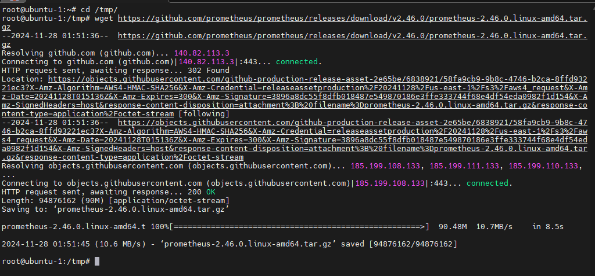

4) We will use the tar command to extract the downloaded file
tar -xvf prometheus-2.46.0.linux-amd64.tar.gz
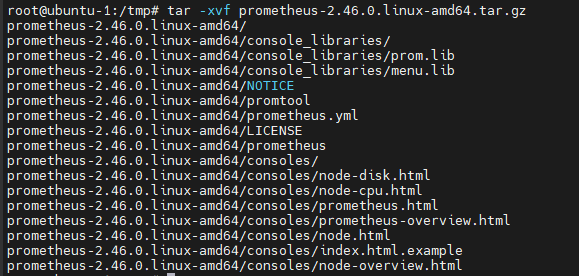

5) We will move the consoles, console_libraries and prometheus.yml  to the prometheus folder /etc/prometheus

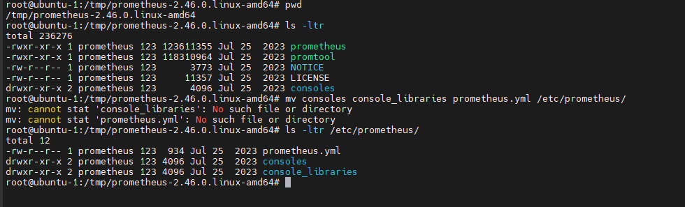

6) Make the folder and the files owned by the system user prometheus and the group prometheus

chown -R prometheus:prometheus /etc/prometheus

7) Move the prometheus folder to the /usr/local/bin

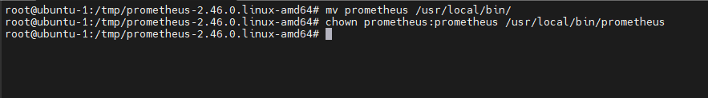

8) Configuration file exists in /etc/prometheus/prometheus.yml
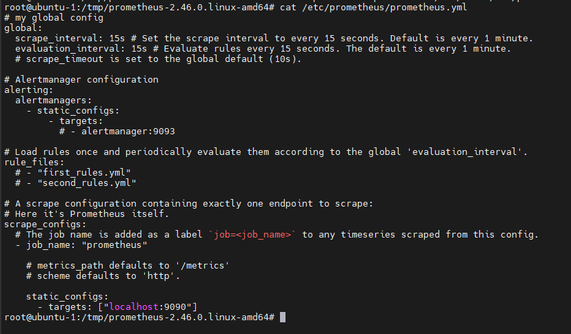

9) create the prometheus systemd service file 
vim /etc/systemd/system/prometheus.service

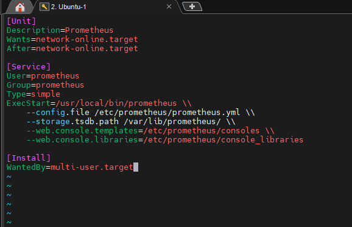

10) # Reload systemd and start Prometheus
sudo systemctl daemon-reload
sudo systemctl start prometheus
sudo systemctl enable prometheus

11) Allow the port via firewall for the service 
sudo ufw allow 9090/tcp

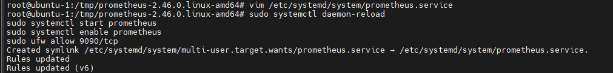

12)  Installing Grafana

wget -q -O - https://packages.grafana.com/gpg.key | sudo apt-key add -
sudo add-apt-repository "deb https://packages.grafana.com/oss/deb stable main"
sudo apt update
sudo apt install -y grafana
sudo systemctl start grafana-server
sudo systemctl enable grafana-server

13) Allow Grafana in firewall
sudo ufw allow 3000/tcp
grafana webpage
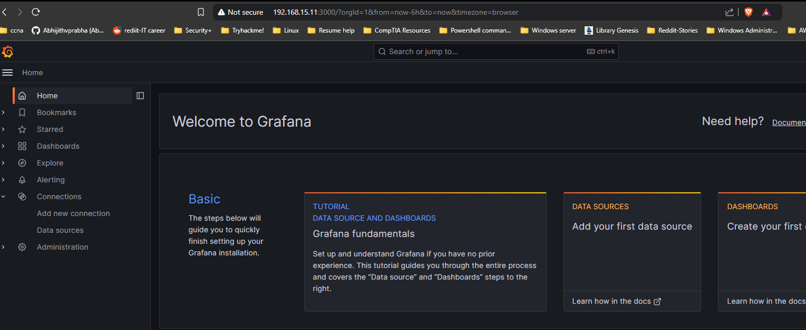

prometheus webpage

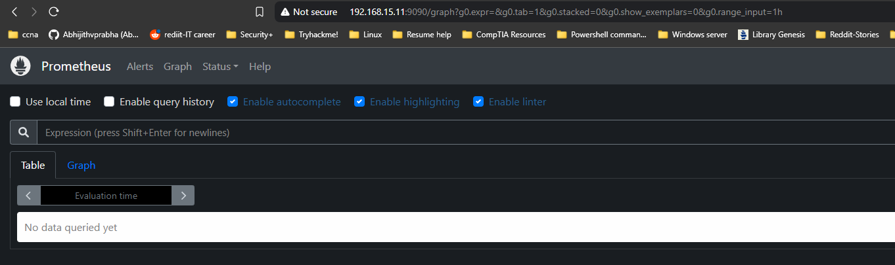

Node Exporter

what is Node exporter? 

Prometheus exporter for hardware and OS metrics exposed by *NIX kernels, written in Go with pluggable metric collectors.

Download and Install node_exporter

Navigate to the node_exporter download and locate the release with the "Latest" tag. At the time of this wiki that is node_exporter-1.8.2.linux-amd64.tar.gz and it will be used as an example in future commands within this wiki.

Downloaded the latest version to the home directory

wget -P ~/ https://github.com/prometheus/node_exporter/releases/download/v1.8.2/node_exporter-1.8.2.linux-amd64.tar.gz

Extract the downloaded file

tar -xvf ~/node_exporter-1.8.2.linux-amd64.tar.gz

Move the extracted files

sudo mv ~/node_exporter-1.8.2.linux-amd64/node_exporter /usr/local/bin/

Remove the unneeded files

rm -rf ~/node_exporter-1.8.2.linux-amd64*

Create the node_exporter user

sudo useradd -r -s /bin/false -c "Node Exporter service account" -d /nonexistent node_exporter

'-r': Creates a system account with a UID < 1000, typically used for system services.
'-s /bin/false': Disables shell access for the user.
'-c' "Node Exporter service account": Adds a comment for clarity.
'-d /nonexistent': Sets the home directory explicitly to a non-existent directory, further ensuring the account is restricted.
Set the user permissions

sudo chown node_exporter:node_exporter /usr/local/bin/node_exporter

Create the service

sudo nano /etc/systemd/system/node_exporter.service

Add the following configuration, the press ctrl + x, then y, then enter to save.

[Unit]
Description=Node Exporter
Wants=network-online.target
After=network-online.target

[Service]
User=node_exporter
Group=node_exporter
Type=simple
ExecStart=/usr/local/bin/node_exporter

[Install]
WantedBy=multi-user.target

Reload the daemon

sudo systemctl daemon-reload

Start the service

sudo systemctl start node_exporter

Enable service to start on boot

sudo systemctl enable node_exporter

Verify the status

sudo systemctl status node_exporter

You should see it is enabled and active
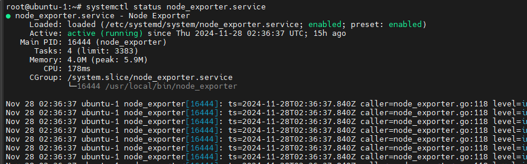

Update Prometheus Config
Update the Config
Open up the prometheus config

sudo nano /etc/prometheus/prometheus.yml

Then add a new job for node_exporter

  - job_name: 'node_exporter'
    static_configs:
      - targets: ['localhost:9100']
        labels:
          instance: '<hostname>'

If the PC that you are installing node_exporter on is not the host that is running prometheus, then you should use the IP of the host that you are installing node_exporter on instead of localhost.

Restart the prometheus service

sudo systemctl restart prometheus

Verify Target is Up
To be sure the node_exporter target was loaded, check the web frontend for Prometheus. Click the "Status" menu item in the navbar and then the "Targets" menu item to see all connected targets

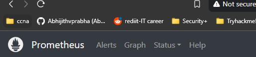

Importing the Dashboard
There is a default dashboard that you can import to get started. Open up Grafana, go to "Dashboards" and then click the button "New", from the dropdown select "Import". Then enter 1860 where it says "URL or ID". Then click "Load"

I usually make the name a bit more descriptive and change the UID slightly as well. Then select the Prometheus data source you set up. Finally click "Import"